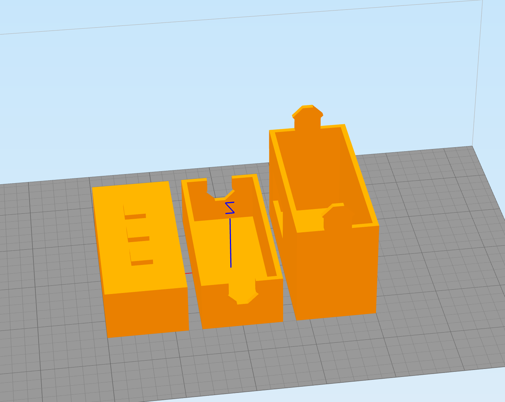
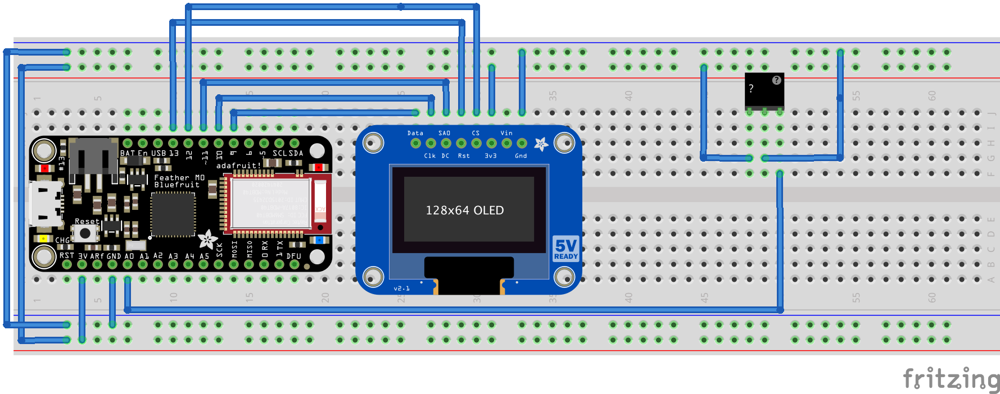
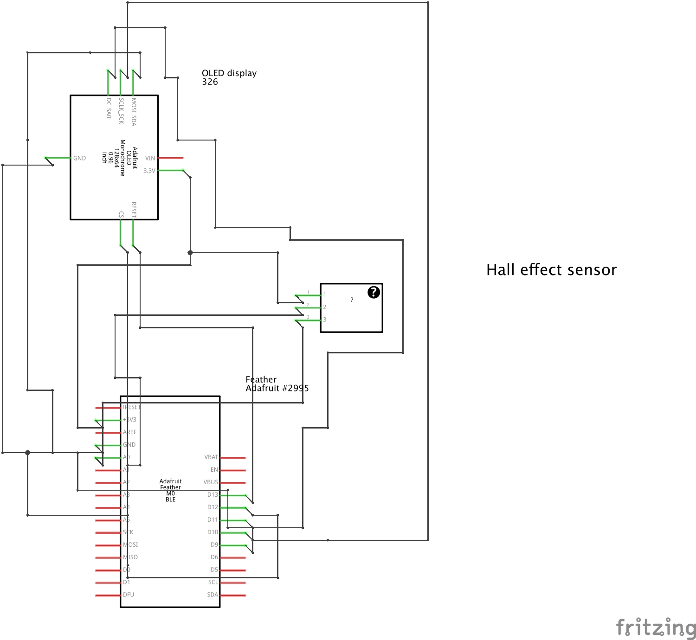

Hamster Fitness
===============
Hi. Thanks for looking at this project. Before you get started please realise that this is just a prototype at this point. 
This will also work for other rodents that like to run in wheels like mice,gerbils and larger hamsters. With some modification you could probably also hook this up to a cat exersise wheel.

The 3d printed parts
--------------------
You can find the 3d printed parts in the subdirectory: 3d_printed
Please print them in PLA

The code
--------
You will need to load the code first and make any modifications. Like say the wheel size.

You will need the following libraries:
--------------------------------------

- Adafruit_SSD1306
- Adafruit_GFX

You will need the following parts and items :
---------------------------------------------
A Kaytee Silent spinner (17 centimeter diameter)
https://www.amazon.com/Kaytee-Hamster-Silent-Spinner-Exercise/dp/B000A7DFUU

An oled display. I used this one:
https://www.adafruit.com/product/326

A feather arduino with Bluetooth LE if you can i intend to add bluetooth support later:
https://www.adafruit.com/products/2995

A hall effect sensor (Cheap so buy a bunch) (I use the a1302 because I had them around)
http://www.digikey.nl/catalog/en/partgroup/a1301-and-a1302/11734

A permaproto board (small) you may need to cut this in half.:
https://www.adafruit.com/products/1608

Ribbon cable:
https://www.floris.cc/shop/en/cable-wire-connectors/414-ribbon-cable-10-wire-450-cm-15ft.html

A Crimp pliers & crimp headers
https://iprototype.nl/products/accessoires/tools/crimp-header-pliers
https://iprototype.nl/products/accessoires/headers/female-crimp-headers

A couple of 5x2mm neodynium magnets:
http://www.ebay.com/itm/100pcs-N50-Super-Strong-Disc-Cylinder-5mm-x-2mm-Rare-Earth-Neodymium-Magnets-/301633569439?hash=item463ac3029f:g:sH8AAOSwhwdVUxpO

Wiring
------
The circuit is pretty simple. Here it is on a breadboard (Made with Fritzing)

And a schematic:

Make sure you test it all out before you glue everything inside the box!

See it in action
----------------
(Video goes here)

](http://www.youtube.com/watch?v=AMvOGSK-nNA "Hamster fitness tracker")
